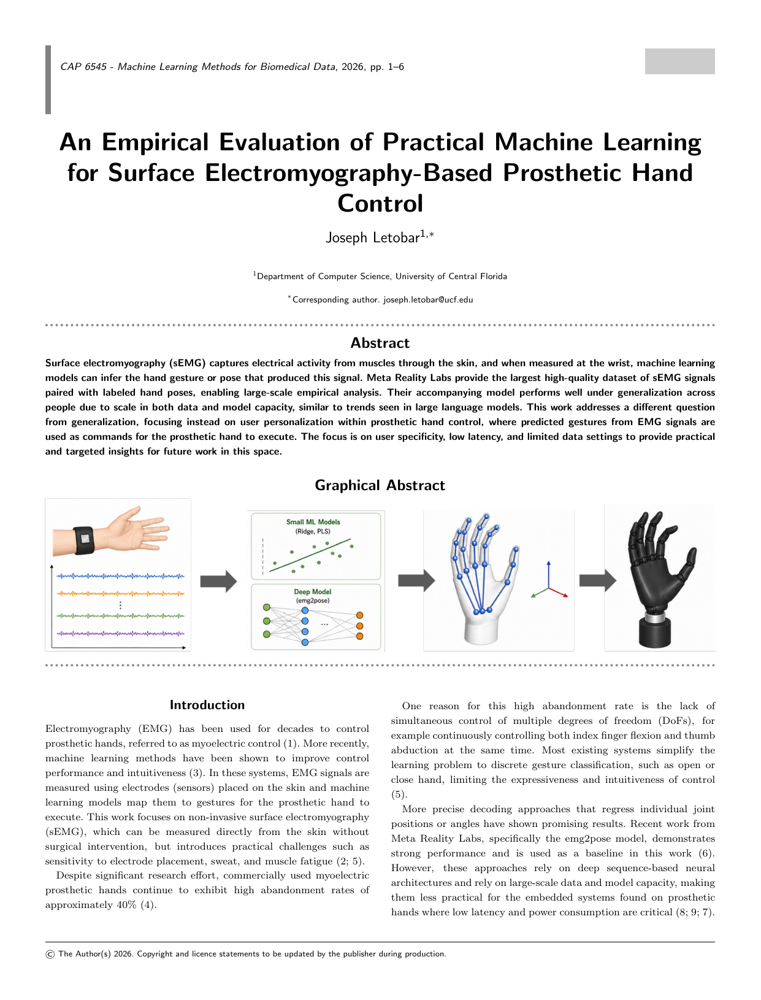

# emg2pose: Evaluation for Prosthetic Control

This project builds on the [emg2pose work by Facebook Research](https://github.com/facebookresearch/emg2pose) and extends its analysis to evaluate how EMG-based pose regression performs in prosthetic control contexts. It focuses on practical constraints such as latency, user variability, data availability, and model capacity, with an emphasis on personalization.

  

  <a href="papers/emg2pose-prosthetic-control-research-paper.pdf">Read the full research paper (PDF)</a>

## Data (Quoted)
A dataset of surface electromyography (sEMG) recordings paired with ground-truth, motion-capture recordings of the hands.
 

  

The entire dataset has 25,253 HDF5 files, each consisting of time-aligned, 2kHz sEMG and joint angles for a single hand in a single stage. Each stage is ~1 minute. There are 193 participants, spanning 370 hours and 29 stages. 

The `metadata.csv` file includes the following information for each HDF5 file:  
  
| Column             | Description |
|--------------------|-------------|
| `user`              | Anonymized user ID |
| `session`           | Recording session (there are multiple stages per recording session) |
| `stage`             | Name of stage |
| `side`              | Hand side (`left` or `right`) |
| `moving_hand`       | Whether the hand is prompted to move during the stage |
| `held_out_user`     | Whether the user is held out from the training set |
| `held_out_stage`    | Whether the stage is held out from the training set |
| `split`             | `train`, `test`, or `val` |
| `generalization`    | Type of generalization; across user (`user`), stage (`stage`), or across user and stage (`user_stage`) |

### Download the Full Dataset (431 GiB)

https://fb-ctrl-oss.s3.amazonaws.com/emg2pose/emg2pose_dataset.tar

### Downloading Pre-trained Checkpoints

https://fb-ctrl-oss.s3.amazonaws.com/emg2pose/emg2pose_model_checkpoints.tar.gz

> — Source: [Original emg2pose repository (Facebook Research)](https://github.com/facebookresearch/emg2pose)

## Code
Code requirements are specified in `environment.yml`, which includes dependencies for this project as well as the original emg2pose library that this analysis builds upon. The file is included in the submission zip.

- `run_experiment.py`  
  Core experiment pipeline, including data loading, model training, and evaluation.

- `run.py`  
  Entry point for automated execution of `run_experiment.py` a specified number of times. Allows configuration of data regimes and models via CLI arguments.

- `avg_metrics.py`  
  Aggregates metrics produced by `run_experiment.py`, optionally filtered by a specific run date, and computes final reported results.

- `experiments` folder  
  - `train_models`  
    Defines all model architectures and training procedures.
  - `models_inference`  
    Defines how each model is used at inference time.
  - `metrics.py`  
    Implements evaluation metrics used in the study, largely based on Meta’s emg2pose library.
  - `data_helpers.py`  
    Provides utilities for loading and preprocessing data.
  - `stream_emg.py`  
    Provides an interface for simulating streaming EMG data, approximating real-time conditions.

- `notebooks` folder  (used for additional analysis supporting the paper)
  - `fine_tune.ipynb`  
    Fine-tunes the emg2pose model by freezing earlier layers and adapting it to a selected held-out user.
  - `subset_training.ipynb`  
    Trains the emg2pose model from scratch on a very small subset of data.

